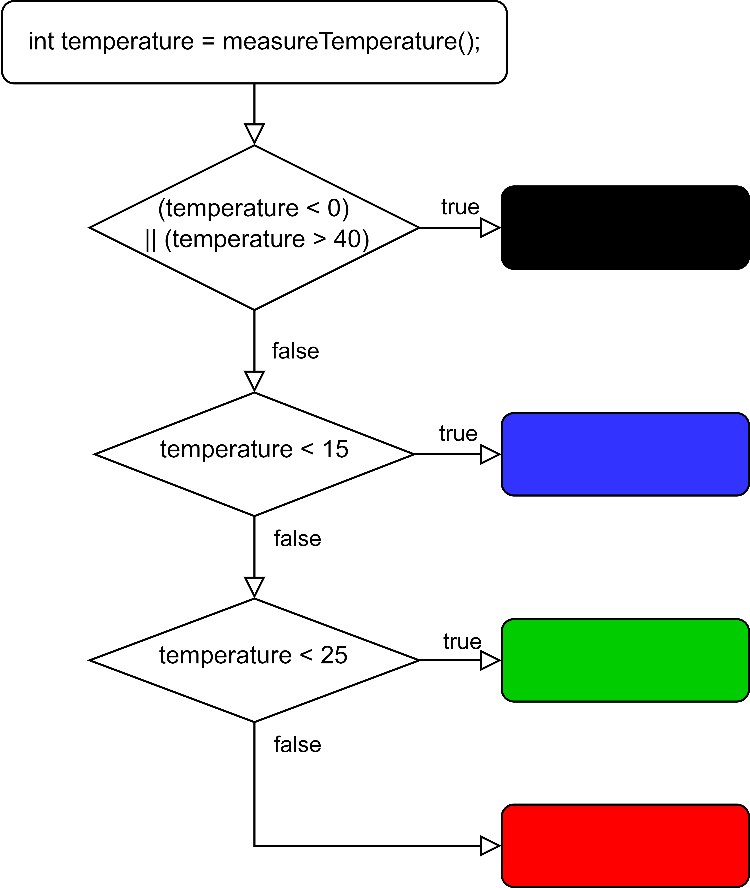

# Session 10: Control Flows

## Conditions

|truthy|falsy|
|---|---|
|`true`|`false`|
|`1`|`0`|
|`25`|`!true`|

### Operators

<details>
	<summary> a > b </summary>

	 a больше b
</details>
<details>
	<summary> a < b </summary>

	 a меньше b
</details>
<details>
	<summary> a == b </summary>

	 a равно b
</details>
<details>
	<summary> a != b </summary>

	 a не равно b
</details>
<details>
	<summary> a >= b </summary>

	 a больше либо равно b
</details>
<details>
	<summary> a <= b </summary>

	 a меньше либо равно b
</details>
<details>
	<summary> (a) || (b) </summary>

	 либо a, либо b 
</details>
<details>
	<summary> (a) && (b) </summary>

	 a и b
</details>
<details>
	<summary> i++ </summary>

	i=i+1
</details>
<details>
	<summary> i-- </summary>

    i=i-1
</details>


## `if` clauses

```c
if(condition1)
{
    // идем сюда, если условие (condition1) выполняется
}
else if(condition2)
{
    // идем сюда, если условие (condition1) не выполняется, условие (condition2) выполняется
}
else if(condition3)
{
    // идем сюда, если условия (condition1, condition2) не выполняются, условие (condition3) выполняется
}
else
{
    // и сюда, если никакие условия не выполняются
}
```

### Exercise: Analyze Code

```c
int temperature;
void loop(){
    temperature = measureTemperature();
    if((temperature<0) || (temperature>40))
    {
        set_led_color(LED_1, 0, 0, 0);
    }
    else if(temperature<15)
    {
        set_led_color(LED_1, 0, 0, 255);
    }
    else if(temperature<25)
    {
        set_led_color(LED_1, 0, 255, 0);
    }
    else
    {
        set_led_color(LED_1, 255, 0, 0);
    }
}
```

---


## `for` loops

### Base Loop

```c
// x = 7 -> 8 -> 9 -> 10 -> 11
for(int i=7; i<12; i++){
    // ...
}

// x = 0 -> 1 -> 2 -> 3 -> 4
for(int i=0; i<5; i++){
    // ...
}
```

---

### Exercise: Invert Loop

```c
// x = 4 -> 3 -> 2 -> 1 -> 0
for(int i=__; i__; ___){
        // ...
    } 
```

<details>
    <summary>Solution</summary>

    ```c
    for(int i=4; i>=0; i--){
        // ...
    } 
    ```
</details>

---

### Exercise: Analyze Loop

```c
for(int i=0; i<10; i=i+2){
    // ...
} 
```
<details>
    <summary>Solution</summary>

    x = 0 -> 2 -> 4 -> 6 -> 8
</details>

## Practical Part
Write a program that is able to play multiple animations. Switch between animations with your remote control.

Include:

- an icon (smiley / drawing) 
- an animated icon
- moving text

[Inspiration](https://youtu.be/oqNMgj9v8C8?si=rXaqRSJOYzhbamgJ)
